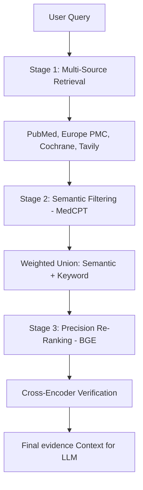

# Comprehensive Evidence Re-Ranking System

**Role:** Technical Documentation Lead
**System:** Multi-Stage Information Retrieval Pipeline

---

## 1. High-Level Architecture

The MedGuidance re-ranking system is designed to solve the "Lost in the Middle" phenomenon and ensure clinical accuracy. It transforms raw API results into highly relevant, evidence-based context for the LLM through a sophisticated 3-stage funnel.

### The Pipeline Structure

---

## 2. Stage 1: Retrieval (High Recall)
We aggregate data from trusted medical repositories. These APIs typically use Keyword Matching (BM25 or TF-IDF) to ensure high recall of potentially relevant documents.
- **PubMed**: Primary clinical studies and trials.
- **Cochrane Library**: Systematic reviews (the Gold Standard).
- **Europe PMC**: Broad biomedical literature and abstract database.
- **Tavily**: Web-based guidelines and verified medical citations from trusted domains.

---

## 3. Stage 2: Semantic Reranking (MedCPT)
**Component:** `lib/evidence/semantic-reranker.ts`

This layer filters out "noise"—articles that contain the right keywords but the wrong clinical context.

### Implementation Details:
- **Embedder**: `MedCPT` (Medical Contrastive Pre-training), specialized for aligning patient queries with clinical documents.
- **Scoring Strategy: Weighted Union** (Critical Differentiator)
    - Unlike naive systems that only use semantic cosine similarity, we combine signals to maintain keyword relevance.
    - **Formula**: `FinalScore = (0.7 * SemanticScore) + (0.3 * KeywordRelevance)`
    - **Why?** Pure vector search can sometimes drift into conceptually similar but factually irrelevant topics. Keeping the keyword signal ensures we stay anchored to the specific medical entities (drugs, diseases) mentioned.
- **Threshold**: Content with `< 0.45` similarity is discarded at this stage.

---

## 4. Stage 3: BGE Cross-Encoder (The Judge)
**Component:** `lib/evidence/bge-reranker.ts`

This is the final, high-precision verification step before data reaches the LLM.

### Why Cross-Encoder?
Stage 2 (Bi-Encoder) compresses documents into fixed vectors. A Cross-Encoder sees the **Query + Document** simultaneously as a single input pair. This allows the model to perform "cross-attention" between every word in the query and every word in the document, capturing nuanced medical relationships.

### The "Clinical Precision" Workflow:
- **Strict Cutoff**: `0.8` confidence threshold.
- **Selectivity**: Capped at top 10 results to prevent LLM context dilution and "lost in the middle" effects.
- **Lexical Tie-Breaking**: If neural scores are too close (`< 0.05` separation), the system applies **Lexical Boosting** (checking for exact matches of drug names or clinical metrics).
- **Dynamic Filtering**: If the top results are too similar in score, the system becomes even more selective, limiting output to the top 5 to ensure only the absolute best evidence is used.

---

## 5. Observability & Feedback (Arize Phoenix)
The entire pipeline is transparent and traceable via Arize Phoenix.
- **Retrieval Traces**: Monitors how many raw documents are found per source.
- **Reranker Funnel**: Tracks the attrition rate at each stage (e.g., 50 found -> 20 semantic -> 5 precision).
- **Latency Analysis**: Measures the performance cost of the Cross-Encoder to optimize batch sizes.
- **Hallucination Loop**: Feedback from actual LLM responses is mapped back to the reranking scores to iteratively adjust thresholds and strategies.
