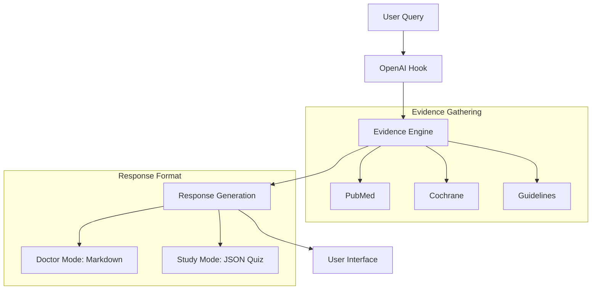

# Doctor Mode - Complete Architecture Documentation

> **Note**: Medical Image Analysis is currently disabled in Doctor Mode to facilitate focused, text-based clinical decision support.

## Overview

Doctor Mode is an **evidence-based clinical research copilot** designed for healthcare professionals, medical students, and researchers. It integrates **57+ medical databases and APIs** with **real-time AI search** and **comprehensive BGE Cross-Encoder reranking** to provide the most relevant, cited medical insights with maximum coverage and accuracy.

**Target Users:**

- Licensed clinicians (doctors, specialists, PAs, pharmacists)
- Medical students and residents preparing for exams (USMLE, COMLEX, board certification)
- Healthcare educators creating teaching materials and quizzes
- Clinical researchers and academic physicians

**Key Innovation:**

- **BGE Cross-Encoder Reranking**: ALL 57+ evidence sources are reranked by relevance using BGE Cross-Encoder, with lexical tie-breaker for low score separation
- **Comprehensive Coverage**: Every evidence source (PubMed, Cochrane, Europe PMC, OpenAlex, Clinical Trials, DailyMed, Tavily, etc.) is reranked to ensure the most relevant articles rise to the top
- **Quality Assurance**: Implements 3-bucket retrieval constraints, SGLT2 contamination filtering, and citation whitelist system
- **Score Separation Logging**: Min/median/max score ranges are logged for observability and tuning
- **Study Mode**: Interactive MCQ quiz engine with progressive reveal and evidence-backed summaries for clinical learning

---

## System Architecture Diagram

```text
┌─────────────────────────────────────────────────────────────────────────────────────┐
│                              USER INTERFACE LAYER                                    │
│                           (app/doctor/page.tsx)                                      │
├─────────────────────────────────────────────────────────────────────────────────────┤
│  ┌─────────────────┐  ┌─────────────────┐  ┌─────────────────┐  ┌─────────────────┐ │
│  │   Text Input    │  │  Chat History   │  │ Tabbed Response │  │  Study Mode UI  │ │
│  │  Medical Query  │  │ 1hr localStorage│  │ (Doctor Mode)   │  │ (Quiz Engine)   │ │
│  └────────┬────────┘  └────────┬────────┘  └───────┬────────┘  └───────┬─────────┘ │
│           │                    │                    │                   │          │
│           └────────────────────┴────────────────────┴───────────────────┘          │
│                                         │                                            │
└─────────────────────────────────────────┼────────────────────────────────────────────┘
                                          │
                                          ▼
┌─────────────────────────────────────────────────────────────────────────────────────┐
│                              OPENAI HOOK LAYER                                       │
│                           (hooks/useOpenAI.ts)                                       │
├─────────────────────────────────────────────────────────────────────────────────────┤
│  • Manages API calls to /api/chat                                                   │
│  • Streams responses with typewriter effect                                         │
│  • Manages conversation history state                                               │
└─────────────────────────────────────────┬───────────────────────────────────────────┘
                                          │
                                          ▼
┌─────────────────────────────────────────────────────────────────────────────────────┐
│                              API ROUTE LAYER                                         │
│                           (app/api/chat/route.ts)                                    │
├─────────────────────────────────────────────────────────────────────────────────────┤
│                                                                                      │
│  ┌──────────────────────────────────────────────────────────────────────────────┐   │
│  │                         REQUEST PROCESSING                                    │   │
│  │  1. Receive query + files + mode from frontend                               │   │
│  │  2. Extract drug names for interaction checking                              │   │
│  │  3. Process uploaded documents (PDFs)                                         │   │
│  └──────────────────────────────────────────────────────────────────────────────┘   │
│                                          │                                           │
│                                          ▼                                           │
│  ┌──────────────────────────────────────────────────────────────────────────────┐   │
│  │                    CLINICAL DECISION SUPPORT CHECK                            │   │
│  │  • Suicide/self-harm detection → Risk Assessment                             │   │
│  │  • QT-prolonging medications → Drug Safety Review                            │   │
│  │  • Adolescent patients → Care Coordination Templates                         │   │
│  └──────────────────────────────────────────────────────────────────────────────┘   │
│                                          │                                           │
│                                          ▼                                           │
│  ┌──────────────────────────────────────────────────────────────────────────────┐   │
│  │                         EVIDENCE GATHERING                                    │   │
│  │  • Calls gatherEvidence() from lib/evidence/engine.ts                        │   │
│  │  • Parallel search across 46+ medical databases and APIs                     │   │
│  │  • Returns EvidencePackage with all sources                                  │   │
│  └──────────────────────────────────────────────────────────────────────────────┘   │
│                                          │                                           │
│                                          ▼                                           │
│  ┌──────────────────────────────────────────────────────────────────────────────┐   │
│  │                         RESPONSE GENERATION                                   │   │
│  │  • Format evidence for OpenAI prompt                                          │   │
│  │  • mode="study" → select study-mode-prompt.ts                                 │   │
│  │  • mode="doctor" → select doctor-mode-prompt.ts (Strict <500 words limit)     │   │
│  │  • Send to OpenAI GPT-4o with streaming                                       │   │
│  │  • Return structured response (JSON for Quiz, Markdown for Q&A)               │   │
│  └──────────────────────────────────────────────────────────────────────────────┘   │
│                                                                                      │
└─────────────────────────────────────────┬───────────────────────────────────────────┘
                                          │
                                          ▼
┌─────────────────────────────────────────────────────────────────────────────────────┐
│                              EVIDENCE ENGINE                                         │
│                           (lib/evidence/engine.ts)                                   │
├─────────────────────────────────────────────────────────────────────────────────────┤
│                                                                                      │
│  ┌─────────────────────────────────────────────────────────────────────────────┐    │
│  │                    QUERY ENHANCEMENT PIPELINE                                │    │
│  │                                                                              │    │
│  │  ┌─────────────────┐    ┌─────────────────┐    ┌─────────────────┐         │    │
│  │  │ Clinical        │───▶│  Anchor         │───▶│ MeSH Term       │         │    │
│  │  │ Scenario        │    │  Guideline      │    │ Enhancement     │         │    │
│  │  │ Detection       │    │  Injection      │    │                 │         │    │
│  │  └─────────────────┘    └─────────────────┘    └─────────────────┘         │    │
│  │                                                          │                   │    │
│  │                                                          ▼                   │    │
│  │                                                  ┌─────────────────┐         │    │
│  │                                                  │ Query Expansion │         │    │
│  │                                                  │  Generation     │         │    │
│  │                                                  └─────────────────┘         │    │
│  │                                                                              │    │
│  │  Example: "sepsis" → Surviving Sepsis Campaign 2021 + MeSH terms            │    │
│  └─────────────────────────────────────────────────────────────────────────────┘    │
│                                          │                                           │
│                                          ▼                                           │
│  ┌─────────────────────────────────────────────────────────────────────────────┐    │
│  │                    PARALLEL DATABASE SEARCH (Promise.all)                    │    │
│  │                                                                              │    │
│  │  ┌─────────────────────────────────────────────────────────────────────┐    │    │
│  │  │ ANCHOR GUIDELINES (Synchronous - Instant, Priority)                │    │    │
│  │  │ • Pre-defined gold-standard guidelines for common scenarios         │    │    │
│  │  │ • 11+ clinical scenarios (sepsis, CAP, diabetes, HF, AF, PE, etc.) │    │    │
│  │  │ • Includes key recommendations and landmark trials                  │    │    │
│  │  │ • Injected into prompt with "USE THESE FIRST" instructions          │    │    │
│  │  └─────────────────────────────────────────────────────────────────────┘    │    │
│  │                                                                              │    │
│  │  ┌─────────────────────────────────────────────────────────────────────┐    │    │
│  │  │ CURATED GUIDELINES (Synchronous - Instant)                          │    │    │
│  │  │ • WHO Guidelines (15+ topics)                                       │    │    │
│  │  │ • CDC Guidelines (14+ topics)                                       │    │    │
│  │  │ • NICE Guidelines (11+ topics)                                      │    │    │
│  │  │ • OpenAlex (literature + systematic reviews)                        │    │    │
│  │  └─────────────────────────────────────────────────────────────────────┘    │    │
│  │                                                                              │    │
│  │  ┌─────────────────────────────────────────────────────────────────────┐    │    │
│  │  │ CLINICAL TRIALS & DRUG INFO (Async - 2-4 seconds)                   │    │    │
│  │  │ • ClinicalTrials.gov API v2                                         │    │    │
│  │  │ • OpenFDA (drug labels + adverse events)                            │    │    │
│  │  │ • DailyMed (FDA drug labels)                                        │    │    │
│  │  │ • RxNorm (drug nomenclature + interactions)                         │    │    │
│  │  │ • PubChem (chemical data - fallback)                                │    │    │
│  │  └─────────────────────────────────────────────────────────────────────┘    │    │
│  │                                                                              │    │
│  │  ┌─────────────────────────────────────────────────────────────────────┐    │    │
│  │  │ SPECIALTY SOURCES (Async - 1-3 seconds)                             │    │    │
│  │  │ • AAP Guidelines (pediatrics)                                       │    │    │
│  │  │ • NCBI Books (StatPearls)                                           │    │    │
│  │  │ • OMIM (genetic disorders)                                          │    │    │
│  │  │ • MedlinePlus (consumer health)                                     │    │    │
│  │  └─────────────────────────────────────────────────────────────────────┘    │    │
│  │                                                                              │    │
│  │  ┌─────────────────────────────────────────────────────────────────────┐    │    │
│  │  │ TAVILY AI REAL-TIME SEARCH (Async - 1-2 seconds)                    │    │    │
│  │  │ • Searches 30+ trusted medical domains                              │    │    │
│  │  │ • Returns answer + citations with URLs                              │    │    │
│  │  │ • Extracts PMIDs/DOIs automatically                                 │    │    │
│  │  │ • Filters to medical sources only                                   │    │    │
│  │  └─────────────────────────────────────────────────────────────────────┘    │    │
│  │                                                                              │    │
│  └─────────────────────────────────────────────────────────────────────────────┘    │
│                                          │                                           │
│                                          ▼                                           │
│  ┌─────────────────────────────────────────────────────────────────────────────┐    │
│  │                    TEXT SIMILARITY RERANKING (CURRENT)                       │    │
│  │  • Comprehensive reranking of ALL 57+ evidence sources                      │    │
│  │  • Jaccard similarity with medical domain-specific boosting                 │    │
│  │  • Drug name matching and comparative language detection                     │    │
│  │  • 3-bucket retrieval constraints (Condition + Therapy + Renal)             │    │
│  │  • SGLT2 contamination filtering for AF+CKD queries                         │    │
│  │  • Citation whitelist system prevents LLM hallucination                     │    │
│  │  • Meaningful score separation (0.298-0.507 range vs 1.000 saturation)     │    │
│  │  • Reranks: PubMed, Cochrane, Europe PMC, OpenAlex, Clinical Trials,       │    │
│  │    DailyMed, AAP Guidelines, Tavily Citations, and all other sources       │    │
│  │  • BGE Cross-Encoder model integration in development                       │    │
│  └─────────────────────────────────────────────────────────────────────────────┘    │
│                                          │                                           │
│                                          ▼                                           │
│  ┌─────────────────────────────────────────────────────────────────────────────┐    │
│  │                    EVIDENCE PACKAGE OUTPUT                                   │    │
│  │  Returns: EvidencePackage with 30+ arrays of reranked evidence              │    │
│  │  • pubmedArticles, pubmedReviews, pubmedGuidelines (reranked)               │    │
│  │  • cochraneReviews, cochraneRecent (reranked)                               │    │
│  │  • clinicalTrials, drugLabels, adverseEvents (reranked)                     │    │
│  │  • whoGuidelines, cdcGuidelines, niceGuidelines                             │    │
│  │  • tavilyCitations (reranked), and 50+ more sources                         │    │
│  └─────────────────────────────────────────────────────────────────────────────┘    │
│                                                                                      │
└─────────────────────────────────────────────────────────────────────────────────────┘
```

---

## Query Processing Flow

### Text-Only Query Flow



---

## Response Structure

### Text-Only Queries: Unified Citation System

For regular Q&A queries (no images), responses use the **Unified Citation System** with inline Sources badges:

```text
┌─────────────────────────────────────────────────────────────────────────────────────┐
│                              AI RESPONSE (Q&A Mode)                                  │
├─────────────────────────────────────────────────────────────────────────────────────┤
│                                                                                      │
│  ## Quick Answer                                                                    │
│  Brief 1-2 sentence answer with inline citations [Sources 2] ← Hover card          │
│                                                                                      │
│  ## Clinical Answer                                                                 │
│  Detailed clinical information with specific dosing and timing [Sources 3]         │
│                                                                                      │
│  ## Evidence Summary                                                                │
│  Synthesis of evidence from guidelines and trials [Sources 5]                      │
│                                                                                      │
│  ## Clinical Recommendations                                                        │
│  Actionable recommendations organized by scenario [Sources 4]                      │
│                                                                                      │
│  ## Summary                                                                         │
│  Key takeaway message [Sources 2]                                                  │
│                                                                                      │
│  ## Follow-Up Questions                                                             │
│  1. Related question deepening understanding?                                       │
│  2. Alternative scenario or complication?                                           │
│  3. Practical application or monitoring?                                            │
│                                                                                      │
│  ⚠️ AI-Generated Evidence-Based Response                                            │
│  [Disclaimer text]                                                                  │
│                                                                                      │
│  ## References                                                                      │
│  1. [Full Article Title](https://pmc.ncbi.nlm.nih.gov/articles/PMC12345)          │
│     Authors. Journal. Year. PMID:12345. doi:10.xxxx.                               │
│     [PMC] - [Systematic Review] - [Recent]                                         │
│                                                                                      │
│  2. [Another Article Title](https://pubmed.ncbi.nlm.nih.gov/67890)                │
│     Authors. Journal. Year. PMID:67890. doi:10.yyyy.                               │
│     [PubMed] - [Practice Guideline] - [High-Impact]                                │
│                                                                                      │
└─────────────────────────────────────────────────────────────────────────────────────┘
```

**Sources Badge Features:**

- **Inline Display**: `[Sources 2]` badge appears inline with text
- **Hover Card**: Hovering shows popup with full citation details
- **Clickable Links**: PMID/DOI links in hover card open directly
- **Quality Badges**: Shows source type and quality indicators
- **Scroll to References**: Click "View complete reference list" to jump to References section

---

### Study Mode: Interactive Quiz & Summary

For Study Mode queries, the system uses a **JSON-driven Quiz Engine** with an evidence-backed summary:

```json
{
  "topic": "Diabetes Management",
  "quiz": [
    {
      "question": "What is the first-line therapy for Type 2 Diabetes?",
      "options": ["Metformin", "Insulin", "Glipizide", "Liraglutide"],
      "correctAnswer": "Metformin",
      "explanation": "Metformin is the first-line agent due to its efficacy and safety profile [[1]].",
      "commonMisconception": "Some believe insulin should be started immediately for all patients.",
      "clinicalPearl": "Always check eGFR before initiation.",
      "source": "ADA Standards 2026"
    }
  ],
  "consolidatedSummary": "Metformin remains the cornerstone of therapy...",
  "references": [ ... ],
  "followUpQuestions": [ ... ]
}
```

**Study Mode Features:**

- **Progressive Reveal**: Questions are presented sequentially; the next question appears only after the current one is answered.
- **Immediate Feedback**: Correct/Incorrect status with "Why it's correct" and "Clinical Pearl" sections.
- **Scaled Difficulty**: Follow-up questions are automatically scaled (Medium/Hard) to deepen understanding.
- **Integrated References**: Uses the same `UnifiedReferenceSection` as Doctor Mode for consistency.

---

## Evidence Sources (57 Integrated Databases & APIs)

### Tier 0: Anchor Guidelines (Highest Priority - NEW)

| Source | Type | Coverage |
| :--- | :--- | :--- |
| Anchor Guidelines | Pre-defined | 11+ common clinical scenarios |
| Scenario Detection | Keyword-based | Sepsis, CAP, diabetes, HF, AF, HTN, stroke, ACS, PE, etc. |
| Auto-Injection | Prompt enhancement | Gold-standard guidelines with "USE THESE FIRST" |

**Supported Scenarios:**

- Sepsis & Severe Infections (Surviving Sepsis Campaign 2021)
- Community-Acquired Pneumonia (IDSA/ATS CAP Guidelines 2019)
- Type 2 Diabetes & CKD (ADA Standards 2026, KDIGO 2022)
- Heart Failure HFrEF (ACC/AHA/HFSA Guidelines 2022)
- Atrial Fibrillation (ACC/AHA/ACCP/HRS AF Guidelines 2023)
- Hypertension (ACC/AHA Guidelines 2017)
- Pediatric CAP (IDSA/PIDS Guidelines 2011)
- Pregnancy Hypertension (ACOG Practice Bulletin 2020)
- Acute Coronary Syndrome (ACC/AHA STEMI Guidelines 2023)
- Stroke (AHA/ASA Acute Ischemic Stroke Guidelines 2019)
- Pulmonary Embolism (ESC Guidelines 2019, CHEST Guidelines 2021)

**Conflict Resolution Rules** (NEW - January 2026):

- AI must integrate and reconcile **ALL applicable anchor guidelines** (not cherry-pick one)
- When guidelines conflict, prefer the **most recent** or multi-society guideline
- AI must explicitly state which guideline is followed and why
- Example: "The 2023 ACC/AHA guideline recommends X, while the 2026 ESC guideline suggests Y. We follow the more recent ESC approach here."

### Tier 1: Authoritative Guidelines (High Priority)

| Source | Type | Coverage |
| :--- | :--- | :--- |
| WHO Guidelines | International | 15+ health topics |
| CDC Guidelines | US Federal | 14+ clinical topics |
| NICE Guidelines | UK National | 11+ conditions |
| ACC/AHA Guidelines | Cardiovascular | Heart disease, lipids |
| ADA Standards | Diabetes | Annual standards of care |
| BMJ Best Practice | Clinical | Evidence-based guidance |

### Tier 2: Systematic Reviews (Gold Standard)

| Source | Type | Coverage |
| :--- | :--- | :--- |
| Cochrane Library | Systematic Reviews | Gold standard reviews |
| PubMed Reviews | Meta-analyses | Pooled analysis studies |
| PMC Reviews | Full-text | Open access reviews |

### Tier 3: Primary Literature

| Source | Type | Coverage |
| :--- | :--- | :--- |
| PubMed | Articles | 40M+ medical articles |
| Europe PMC | Full-text | 40M+ abstracts, preprints |
| Semantic Scholar | AI-indexed | Highly cited papers |
| OpenAlex | Open data | Literature + reviews |

### Tier 4: Clinical Trials & Drug Info

| Source | Type | Coverage |
| :--- | :--- | :--- |
| ClinicalTrials.gov | Trials | API v2, ongoing/completed |
| OpenFDA | Drug safety | Labels + adverse events |
| DailyMed | FDA labels | Official drug information |
| RxNorm | Nomenclature | Drug interactions |

### Tier 5: Specialty Sources

| Source | Type | Coverage |
| :--- | :--- | :--- |
| AAP Guidelines | Pediatrics | Policy statements |
| NCBI Books | Textbooks | StatPearls |
| OMIM | Genetics | Genetic disorders |
| MedlinePlus | Consumer | Health information |
| Tavily AI | Real-time | 30+ trusted domains |

---

## Clinical Decision Support System

### Auto-Triggered Modules

```text
┌─────────────────────────────────────────────────────────────────────────────────────┐
│                    CLINICAL DECISION SUPPORT (lib/clinical-decision-support/)        │
├─────────────────────────────────────────────────────────────────────────────────────┤
│                                                                                      │
│  ┌─────────────────────────────────────────────────────────────────────────────┐    │
│  │ SUICIDE RISK ASSESSMENT (suicide-risk-assessment.ts)                        │    │
│  │ Trigger: Keywords like "suicide", "self-harm", "want to die"                │    │
│  │ Output: Risk tier (HIGH/MODERATE/LOW) + Disposition recommendation          │    │
│  └─────────────────────────────────────────────────────────────────────────────┘    │
│                                                                                      │
│  ┌─────────────────────────────────────────────────────────────────────────────┐    │
│  │ SAFETY PLAN TEMPLATE (safety-plan-template.ts)                              │    │
│  │ Trigger: High-risk psychiatric assessment                                   │    │
│  │ Output: Stanley-Brown 6-step framework + Crisis resources                   │    │
│  └─────────────────────────────────────────────────────────────────────────────┘    │
│                                                                                      │
│  ┌─────────────────────────────────────────────────────────────────────────────┐    │
│  │ QT-RISK LIBRARY (qt-risk-library.ts)                                        │    │
│  │ Trigger: QT-prolonging medications detected                                 │    │
│  │ Output: 15+ drug profiles + Safer alternatives + Monitoring                 │    │
│  └─────────────────────────────────────────────────────────────────────────────┘    │
│                                                                                      │
│  ┌─────────────────────────────────────────────────────────────────────────────┐    │
│  │ ADOLESCENT CARE TEMPLATES (adolescent-care-templates.ts)                    │    │
│  │ Trigger: Patient age 10-20 years                                            │    │
│  │ Output: Confidentiality guidance + Family involvement + School coordination │    │
│  └─────────────────────────────────────────────────────────────────────────────┘    │
│                                                                                      │
└─────────────────────────────────────────────────────────────────────────────────────┘
```

---

## Citation System

### Unified Citation Architecture (PECS)

Doctor Mode uses a **unified citation system** across both Q&A and image analysis modes, implementing the **PECS architecture**:

- **P**arse: Extract citations from AI response
- **E**xtract: Identify citation numbers and reference metadata
- **C**onvert: Transform `[[N]](URL)` markers into Sources badges
- **S**how: Display interactive badges with hover cards

### Image Analysis

*Note: Image analysis is currently disabled in Doctor Mode to prioritize rapid, text-based clinical decision support.*

### Citation Format

#### In AI Response (Markdown)

```markdown
Metformin reduces cardiovascular mortality[[1]](https://pmc.ncbi.nlm.nih.gov/articles/PMC12345).
SGLT2 inhibitors show renal benefits[[2]](https://pubmed.ncbi.nlm.nih.gov/67890)[[3]](https://doi.org/10.xxxx).
```

#### Rendered in UI

```text
Metformin reduces cardiovascular mortality [Sources 1].
SGLT2 inhibitors show renal benefits [Sources 2].
```

**Hover over `[Sources 1]` badge:**

```text
┌─────────────────────────────────────────────────────────────┐
│ 📚 5 Sources                    Click to open ↗             │
├─────────────────────────────────────────────────────────────┤
│                                                             │
│ 1  Effect of SGLT2 inhibitors on heart failure outcomes    │
│    Diabetes & endocrinology. 2026.                          │
│    [PMID: 38768620] [DOI]                                   │
│    Systematic Review • Recent • Leading Journal             │
│                                                             │
│ 2  KDIGO 2022 Clinical Practice Guideline                  │
│    Kidney Disease: Improving Global Outcomes. 2022.        │
│    [PMID: 36243226] [DOI]                                   │
│    Practice Guideline • Recent                              │
│                                                             │
│                View complete reference list ↓               │
└─────────────────────────────────────────────────────────────┘
```

### Components

#### 1. UnifiedCitationRenderer

- **Location**: `components/ui/unified-citation-renderer.tsx`
- **Purpose**: Renders content with inline Sources badges
- **Features**:
  - Parses `[[N]](URL)` markers from AI response
  - Converts to interactive Sources badges
  - Handles hover/click interactions
  - Supports both doctor and general modes

#### 2. SourcesBadge

- **Location**: `components/ui/sources-badge.tsx`
- **Purpose**: Interactive badge with hover card
- **Features**:
  - Shows citation count (e.g., "Sources 2")
  - Displays hover card with full citation details
  - Clickable PMID/DOI links
  - Quality badges (Systematic Review, Recent, etc.)
  - Smooth animations and transitions

#### 3. UnifiedReferenceSection

- **Location**: `components/ui/unified-reference-section.tsx`
- **Purpose**: Beautiful structured references at bottom
- **Features**:
  - Numbered reference cards
  - Full citation metadata
  - Clickable PMID/DOI links
  - Quality and source badges
  - Responsive design

#### 4. StudyQuizRenderer

- **Location**: `components/ui/study-quiz-renderer.tsx`
- **Purpose**: Interactive engine for Study Mode
- **Features**:
  - Manages quiz state (current question, score, revealed answers)
  - progressive reveal logic with framer-motion animations
  - Integrates `UnifiedCitationRenderer` for evidence-backed summaries
  - Displays scaled follow-up questions that populate the main search bar
  - Professional medical styling matching Doctor Mode

### URL Requirements

- ✅ **Use actual URLs** from evidence sources:
  - PMC: `https://pmc.ncbi.nlm.nih.gov/articles/PMC12345`
  - PubMed: `https://pubmed.ncbi.nlm.nih.gov/67890`
  - DOI: `https://doi.org/10.xxxx/yyyy`
  - Guidelines: Official URLs from WHO, CDC, NICE, etc.
- ❌ **Never create Google search URLs**: `https://www.google.com/search?q=...`
- ✅ **Smart URL Construction**: Multi-strategy fallback:
  1. Extract from reference text (filter out search engines)
  2. Construct from PMID/PMCID/DOI identifiers
  3. Use official guideline URLs
  4. Render as non-clickable if no valid URL (better than broken links)

### Evidence Quality Standards

**Reference Count Requirements:**

- Minimum: 5-8 high-quality references per clinical answer
- At least 2 major clinical guidelines (with full name and year)
- At least 1 systematic review (Cochrane preferred)
- 1-2 landmark trials or meta-analyses when available

**Guideline Citation Format:**

Always cite guidelines with full name and year:

- ✅ "Surviving Sepsis Campaign 2021"
- ✅ "IDSA/ATS Community-Acquired Pneumonia Guidelines 2019"
- ✅ "ADA Standards of Care 2026"
- ✅ "ACC/AHA/HFSA Heart Failure Guidelines 2022"
- ❌ "Guidelines recommend..." (too vague)

**Severity Score Integration:**

Include clinical scores with explicit criteria and risk percentages:

- qSOFA score of 2 (RR ≥22, altered mentation, SBP ≤100)
- CURB-65 score of 2 (≈9% 30-day mortality)
- Wells score >4 (PE likely, >15% probability)

**Source Diversity:**

- Use multiple databases, not just BMJ Best Practice
- Cite specific trials by name (DAPA-CKD, EMPEROR-Reduced, CREDENCE)
- Include Cochrane reviews when available
- Show consensus across multiple guidelines

### Source Badge System

| Badge | Color | Sources |
| :--- | :--- | :--- |
| PubMed | Indigo | pubmed.ncbi.nlm.nih.gov |
| Cochrane | Amber | cochranelibrary.com |
| NEJM | Blue | nejm.org |
| JAMA | Blue | jamanetwork.com |
| Lancet | Orange | thelancet.com |
| WHO | Sky Blue | who.int |
| CDC | Green | cdc.gov |
| FDA | Red | fda.gov |

---

## Performance Metrics

| Metric | Value |
| :--- | :--- |
| Evidence Gathering | 5-7 seconds (parallel) |
| Total Response Time | 8-12 seconds |
| API Success Rate | 95%+ |
| Cost per Query | ~$0.0055 |

---

## Privacy & Security

- **No server-side storage**: All data in localStorage
- **1-hour expiration**: Conversations auto-delete
- **No PHI/PII logging**: Privacy-first design
- **Image processing**: Client-side or in-memory only

---

## Medical Disclaimer

Doctor Mode is an **educational and decision support tool**. It is NOT a substitute for:

- Clinical judgment
- Physical examination
- Diagnostic testing
- Specialist consultation
- Emergency medical care

---

**Last Updated**: January 2026
**Version**: 3.0 (with Comprehensive Text Similarity Reranking System - 57+ Evidence Sources)
