# OpenWork AI - Mermaid Flowchart

Copy and paste the code below into any Mermaid renderer (like mermaid.live, GitHub, or Mermaid editors):

## Unified Workflow - Research & Study Modes (Complete 7-Agent Process):

```mermaid
flowchart TD
    %% User Input & Mode Selection
    A[👤 User Query<br/>"Compare apixaban vs rivaroxaban<br/>in AF with CKD eGFR 30-50"] --> MODE{Mode Selection<br/>Research or Study?}
    
    MODE -->|Research Mode| B1[🧠 AGENT 1: Query Intelligence<br/>Model: Gemini 3.0 Flash<br/>Analyzes medical terminology]
    MODE -->|Study Mode| B2[🧠 AGENT 1: Query Intelligence<br/>Model: Gemini 3.0 Flash<br/>Analyzes medical terminology]
    
    %% Agent 1 Processing (Same for both modes)
    B1 --> C1[Extract Medical Entities<br/>Diseases: Atrial Fibrillation, CKD<br/>Drugs: apixaban, rivaroxaban<br/>Parameters: eGFR 30-50]
    B2 --> C1
    
    C1 --> C2[Generate Search Variants<br/>Expand abbreviations AF→Atrial Fibrillation<br/>Create 3-5 different query phrasings<br/>Add MeSH medical terms]
    C2 --> C3[Determine Required Sources<br/>Guidelines: ✓ (cardiology, nephrology)<br/>PubMed: ✓ (comparative studies)<br/>DailyMed: ✓ (drug labels)]
    C3 --> C4[Calculate Query Complexity<br/>Score: 0.75 (high complexity)<br/>→ Will use Gemini Pro for synthesis]
    
    %% Agent 2: Multi-Source Retrieval (Unified)
    C4 --> D[🔄 AGENT 2: Multi-Source Retrieval<br/>Python Async Orchestrator<br/>Coordinates parallel searches]
    
    %% Sub-Agents (Parallel)
    D --> D1[📚 Sub-Agent 2.1: Guidelines Retriever<br/>Searches Indian Clinical Guidelines<br/>Uses Firestore Vector Database]
    D --> D2[🔬 Sub-Agent 2.2: PubMed Intelligence<br/>Searches NCBI PubMed Database<br/>Uses E-utilities API]
    D --> D4[💊 Sub-Agent 2.4: DailyMed Retriever<br/>Searches FDA Drug Labels<br/>Uses SPL Database API]
    
    D1 --> D1A[Vector Similarity Search<br/>Uses Gemini text-embedding-004<br/>Embeds query variants<br/>→ Returns 18 guideline chunks]
    D2 --> D2A[Advanced PubMed Query<br/>Builds MeSH term queries<br/>Searches multiple variants in parallel<br/>→ Returns 87 articles with metadata]
    D4 --> D4A[FDA Label Extraction<br/>Parses SPL XML format<br/>Extracts dosing & safety sections<br/>→ Returns 2 complete drug labels]
    
    %% Combine Results
    D1A --> E[📊 Combined Evidence Pool<br/>Total: 107 documents<br/>Ready for normalization]
    D2A --> E
    D4A --> E
    
    %% Agent 3: Evidence Normalizer (Unified)
    E --> F[🔧 AGENT 3: Evidence Normalizer<br/>Pure Python Data Transformer<br/>No AI model required]
    F --> F1[Standardize All Formats<br/>Convert to EvidenceCandidate objects<br/>Normalize metadata fields<br/>Title, authors, date, source type]
    F1 --> F2[Deduplicate Sources<br/>Remove identical content<br/>Merge duplicate findings<br/>Across different search variants]
    F2 --> F3[107 Clean Documents<br/>Standardized format<br/>Ready for ML re-ranking]
    
    %% Agent 4: Two-Stage Reranker (Unified)
    F3 --> G[🎯 AGENT 4: BGE Two-Stage Reranker<br/>Model: BAAI/bge-reranker-v2-m3<br/>Cross-encoder ML model]
    
    %% Stage 1
    G --> G1[📋 STAGE 1: Document Ranking<br/>Score all 107 documents<br/>Uses abstracts & snippets<br/>BGE cross-encoder inference]
    G1 --> G2[Select Top 20 Documents<br/>Highest relevance scores<br/>Triggers full-text retrieval]
    
    %% Full-Text Fetcher (Triggered)
    G2 --> D3[📄 Sub-Agent 2.3: Full-Text Fetcher<br/>Retrieves complete article content<br/>Uses PMC XML + Unpaywall APIs]
    D3 --> D3A[Fetch Complete Articles<br/>14 PMC open-access articles<br/>2 Unpaywall PDF articles<br/>4 abstract-only articles]
    
    %% Stage 2
    D3A --> G3[🔍 STAGE 2: Chunk-Level Ranking<br/>Split articles into 1000-char segments<br/>200-char overlap between chunks<br/>Re-rank all chunks with BGE]
    G3 --> G4[Final Top 10 Evidence Chunks<br/>Combined scoring algorithm<br/>60% chunk score + 40% document score<br/>Highest quality evidence selected]
    
    %% Agent 5: Evidence Gap Analyzer (Unified)
    G4 --> H[🔍 AGENT 5: Evidence Gap Analyzer<br/>Model: Gemini 3.0 Pro<br/>Analyzes evidence completeness]
    H --> H1[Assess Evidence Coverage<br/>Check all query aspects covered<br/>Evaluate source recency (flag >3 years)<br/>Analyze study quality distribution]
    H1 --> H2[Detect Evidence Issues<br/>Find contradictions between sources<br/>Identify missing evidence types<br/>Note gaps in patient populations]
    H2 --> H3{Gap Analysis Decision<br/>Sufficient evidence?}
    
    %% Conditional Tavily
    H3 -->|Gaps Detected| D5[🌐 Sub-Agent 2.5: Tavily Search<br/>Searches recent web content<br/>Targets medical domains only]
    H3 -->|Evidence Complete| SYNTHESIS{Agent 6: Synthesis Engine<br/>Mode-dependent processing}
    D5 --> D5A[Smart Web Search<br/>Search recent medical publications<br/>Filter authoritative domains<br/>Deduplicate against existing sources]
    D5A --> SYNTHESIS
    
    %% Agent 6: Mode-Dependent Synthesis
    SYNTHESIS -->|Research Mode| J1[✍️ Evidence Synthesis<br/>Model: Gemini 3.0 Pro (complex queries)<br/>or Gemini 3.0 Flash (simple queries)]
    SYNTHESIS -->|Study Mode| J2[📚 Quiz Generation<br/>Model: Gemini 3.0 Pro<br/>Uses Study Mode System Prompt]
    
    %% Research Mode Synthesis
    J1 --> J1A[Format Evidence Sources<br/>Assign citation numbers [1][2][3]<br/>Prepare source reference list<br/>Map citations to evidence chunks]
    J1A --> J1B[Generate Evidence Synthesis<br/>Create comprehensive answer<br/>Maximum 500 words<br/>Require inline citations for all claims]
    J1B --> J1C[Handle Contradictions<br/>Explicitly note conflicting evidence<br/>Present balanced view of disagreements<br/>Maintain research tool positioning]
    
    %% Study Mode Quiz Generation
    J2 --> J2A[Generate 5 MCQs<br/>Progressive difficulty: Easy→Medium→Hard<br/>Clinical focus on protocols & dosing<br/>Evidence-based explanations]
    J2A --> J2B[Create Interactive Format<br/>JSON structure with questions<br/>Correct answers with explanations<br/>Source citations for each explanation]
    
    %% Agent 7: Verification Gate (Unified)
    J1C --> K[🔒 AGENT 7: Verification Gate<br/>Model: Gemini 3.0 Flash<br/>Validates response accuracy]
    J2B --> K
    
    K --> K1[Extract Individual Claims<br/>Parse content into factual statements<br/>Identify each claim requiring evidence<br/>Map claims to cited sources]
    K1 --> K2[Validate Citation Format<br/>Check all citation numbers exist<br/>Verify proper reference formatting<br/>Ensure no broken citations]
    K2 --> K3[Semantic Grounding Check<br/>Verify each claim against cited source<br/>Use Gemini to check claim support<br/>Identify unsupported assertions]
    K3 --> K4[Calculate Grounding Score<br/>Percentage of properly supported claims<br/>Flag uncited or unsupported statements<br/>Generate quality confidence metric]
    
    %% Final Outputs
    K4 --> L1[📄 Research Response<br/>Evidence synthesis with numbered citations<br/>Source references with direct links<br/>Quality metrics & grounding score<br/>Full Arize observability tracing]
    
    K4 --> L2[📚 Study Response<br/>Interactive quiz with 5 MCQs<br/>Progressive difficulty & feedback<br/>Evidence-based explanations<br/>Learning summary & follow-ups]
    
    %% Styling
    classDef agent fill:#e1f5fe,stroke:#01579b,stroke-width:2px,color:#000
    classDef subagent fill:#f3e5f5,stroke:#4a148c,stroke-width:2px,color:#000
    classDef process fill:#e8f5e8,stroke:#2e7d32,stroke-width:2px,color:#000
    classDef decision fill:#fff3e0,stroke:#ef6c00,stroke-width:2px,color:#000
    classDef studymode fill:#e8eaf6,stroke:#3f51b5,stroke-width:2px,color:#000
    classDef output fill:#fce4ec,stroke:#c2185b,stroke-width:2px,color:#000
    
    class B1,B2,F,G,H,J1,J2,K agent
    class D1,D2,D3,D4,D5 subagent
    class C1,C2,C3,C4,D1A,D2A,D3A,D4A,D5A,F1,F2,F3,G1,G2,G3,G4,H1,H2,J1A,J1B,J1C,J2A,J2B,K1,K2,K3,K4 process
    class MODE,H3,SYNTHESIS decision
    class J2,J2A,J2B,L2 studymode
    class L1,L2 output
```

## Simplified Workflow Diagram (for smaller displays):

```mermaid
flowchart TD
    A[👤 User Query<br/>Medical research question] --> MODE{Mode Selection<br/>Research or Study?}
    
    MODE -->|Research Mode| B1[🧠 Agent 1: Query Intelligence<br/>Model: Gemini 3.0 Flash<br/>Extracts entities & generates search variants]
    MODE -->|Study Mode| B2[🧠 Agent 1: Query Intelligence<br/>Model: Gemini 3.0 Flash<br/>Extracts entities & generates search variants]
    
    B1 --> C[🔄 Agent 2: Multi-Source Retrieval<br/>Python Async Orchestrator<br/>Parallel search across 5 medical sources]
    B2 --> C
    
    C --> C1[📚 Guidelines Retriever<br/>Firestore Vector Search<br/>Uses Gemini embeddings]
    C --> C2[🔬 PubMed Intelligence<br/>NCBI E-utilities API<br/>MeSH term expansion]
    C --> C3[💊 DailyMed Retriever<br/>FDA Drug Labels<br/>SPL XML parsing]
    
    C1 --> D[🔧 Agent 3: Evidence Normalizer<br/>Pure Python Transformer<br/>Standardizes 100+ documents]
    C2 --> D
    C3 --> D
    
    D --> E[🎯 Agent 4: BGE Reranker<br/>Model: BAAI/bge-reranker-v2-m3<br/>Stage 1: Docs → Stage 2: Chunks]
    E --> E1[📄 Full-Text Fetcher<br/>PMC XML + Unpaywall APIs<br/>Retrieves complete articles]
    E1 --> E2[Top 10 Evidence Chunks<br/>Highest relevance scores<br/>Ready for synthesis]
    
    E2 --> F[🔍 Agent 5: Gap Analyzer<br/>Model: Gemini 3.0 Pro<br/>Assesses quality & coverage]
    F --> F1{Evidence Complete?<br/>Quality sufficient?}
    F1 -->|Gaps Found| G[🌐 Tavily Search<br/>Recent web content<br/>Medical domains only]
    F1 -->|Evidence Complete| H{Agent 6: Synthesis Engine<br/>Mode-dependent processing}
    G --> H
    
    H -->|Research Mode| H1[✍️ Evidence Synthesis<br/>Model: Gemini 3.0 Pro/Flash<br/>Generates answer with citations]
    H -->|Study Mode| H2[📚 Quiz Generation<br/>Model: Gemini 3.0 Pro<br/>Creates 5 MCQs with explanations]
    
    H1 --> I[🔒 Agent 7: Verification Gate<br/>Model: Gemini 3.0 Flash<br/>Validates grounding & citations]
    H2 --> I
    
    I --> J1[📄 Research Response<br/>Evidence synthesis + quality score<br/>Full traceability]
    I --> J2[📚 Study Response<br/>Interactive quiz + learning summary<br/>Progressive feedback]
    
    classDef agent fill:#e1f5fe,stroke:#01579b,stroke-width:2px
    classDef subagent fill:#f3e5f5,stroke:#4a148c,stroke-width:2px
    classDef decision fill:#fff3e0,stroke:#ef6c00,stroke-width:2px
    classDef studymode fill:#e8eaf6,stroke:#3f51b5,stroke-width:2px
    
    class B1,B2,D,E,F,H1,H2,I agent
    class C1,C2,C3,E1,G subagent
    class MODE,F1,H decision
    class H2,J2 studymode
```



## Usage Instructions:

1. **Copy either flowchart code** (detailed or simplified version)
2. **Paste into any Mermaid renderer**:
   - [mermaid.live](https://mermaid.live) (online editor)
   - GitHub markdown (supports Mermaid natively)
   - GitLab, Notion, or other platforms with Mermaid support
   - VS Code with Mermaid extension
3. **Customize colors/styling** by modifying the `classDef` sections at the bottom

The detailed version shows the complete unified 7-agent workflow with mode selection determining the final output format. The simplified version is better for presentations or smaller displays.

---

## High-Level System Architecture (UML Style)

### Mermaid Architecture Diagram (GitHub Compatible):

```mermaid
graph TB
    subgraph "Frontend Layer"
        UI[🖥️ Next.js Frontend<br/>React Components<br/>Tailwind CSS]
        API[🔌 FastAPI Backend<br/>REST Endpoints<br/>WebSocket Support]
    end
    
    subgraph "AI Orchestration Layer"
        ORCH[🎯 Medical Evidence Orchestrator<br/>7-Agent Coordinator<br/>LangGraph State Management]
        
        subgraph "Core Agents"
            A1[🧠 Query Intelligence<br/>Gemini 3.0 Flash]
            A2[🔄 Multi-Source Retrieval<br/>Python Async]
            A3[🔧 Evidence Normalizer<br/>Data Transformer]
            A4[🎯 BGE Reranker<br/>ML Cross-Encoder]
            A5[🔍 Gap Analyzer<br/>Gemini 3.0 Pro]
            A6[✍️ Synthesis Engine<br/>Gemini 3.0 Pro/Flash]
            A7[🔒 Verification Gate<br/>Gemini 3.0 Flash]
        end
    end
    
    subgraph "Data Sources Layer"
        subgraph "Medical Databases"
            PM[📚 PubMed<br/>NCBI E-utilities<br/>36M+ Articles]
            PMC[📄 PMC Full-Text<br/>JATS XML<br/>6M+ Papers]
            CT[🧪 ClinicalTrials.gov<br/>API v2<br/>450K+ Trials]
            DM[💊 DailyMed<br/>FDA SPL<br/>Drug Labels]
        end
        
        subgraph "Guidelines & Web"
            GL[📋 Indian Guidelines<br/>Firestore Vector DB<br/>Gemini Embeddings]
            TV[🌐 Tavily Search<br/>Recent Web Content<br/>Medical Domains]
            UP[🔓 Unpaywall<br/>Open Access PDFs<br/>DOI Resolution]
        end
    end
    
    subgraph "ML & Processing Layer"
        BGE[🤖 BGE Reranker<br/>BAAI/bge-reranker-v2-m3<br/>Cross-Encoder Model]
        EMB[🔤 Text Embeddings<br/>Gemini text-embedding-004<br/>768 Dimensions]
        CHUNK[📝 Text Chunking<br/>RecursiveCharacterTextSplitter<br/>1000 chars + overlap]
    end
    
    subgraph "Storage & Observability"
        FS[🗄️ Google Firestore<br/>Vector Store<br/>Guidelines Database]
        GCS[☁️ Cloud Storage<br/>PMC Cache<br/>Full-text XML]
        AR[📊 Arize AI<br/>LLM Tracing<br/>Hallucination Detection]
        LOG[📝 Cloud Logging<br/>Error Tracking<br/>Performance Metrics]
    end
    
    subgraph "External APIs"
        GM[🤖 Google Gemini<br/>3.0 Flash & Pro<br/>Text Generation]
        HF[🤗 HuggingFace<br/>BGE Model<br/>Transformers]
    end
    
    %% Connections
    UI --> API
    API --> ORCH
    ORCH --> A1
    A1 --> A2
    A2 --> A3
    A3 --> A4
    A4 --> A5
    A5 --> A6
    A6 --> A7
    A7 --> API
    
    %% Data Source Connections
    A2 --> PM
    A2 --> PMC
    A2 --> CT
    A2 --> DM
    A2 --> GL
    A5 --> TV
    A4 --> UP
    
    %% ML Connections
    A4 --> BGE
    A2 --> EMB
    A4 --> CHUNK
    BGE --> HF
    
    %% Storage Connections
    GL --> FS
    PMC --> GCS
    ORCH --> AR
    API --> LOG
    
    %% AI Connections
    A1 --> GM
    A5 --> GM
    A6 --> GM
    A7 --> GM
    EMB --> GM
    
    %% Styling
    classDef frontend fill:#e3f2fd,stroke:#1976d2,stroke-width:2px
    classDef orchestration fill:#f3e5f5,stroke:#7b1fa2,stroke-width:2px
    classDef agents fill:#e8f5e8,stroke:#388e3c,stroke-width:2px
    classDef datasources fill:#fff3e0,stroke:#f57c00,stroke-width:2px
    classDef ml fill:#fce4ec,stroke:#c2185b,stroke-width:2px
    classDef storage fill:#f1f8e9,stroke:#689f38,stroke-width:2px
    classDef external fill:#e0f2f1,stroke:#00796b,stroke-width:2px
    
    class UI,API frontend
    class ORCH orchestration
    class A1,A2,A3,A4,A5,A6,A7 agents
    class PM,PMC,CT,DM,GL,TV,UP datasources
    class BGE,EMB,CHUNK ml
    class FS,GCS,AR,LOG storage
    class GM,HF external
```



### PlantUML Architecture Diagram:


### Component Interaction Diagram (PlantUML):


## Usage Instructions:

### For GitHub (Mermaid):
1. Copy the Mermaid architecture diagram code
2. Paste into GitHub markdown files
3. GitHub will automatically render the diagram

### For PlantUML:
1. Use online editors like [PlantText](https://www.planttext.com/) or [PlantUML Online](http://www.plantuml.com/plantuml/uml/)
2. Download PlantUML locally with Java
3. Use VS Code with PlantUML extension
4. Export as PNG/SVG for documentation

## What Each Diagram Shows:

### 1. **Unified Workflow** (Research & Study Modes):
- **Mode selection** at the beginning determines output format
- **Shared infrastructure** for evidence collection (Agents 1-5)
- **Mode-dependent synthesis** (Agent 6) - Research vs Quiz generation
- **Unified verification** (Agent 7) for both modes

### 2. **Mermaid Architecture** (High-Level System View):
- **System layers** and component relationships
- **Data flow** between major components  
- **External dependencies** and integrations
- **Storage and observability** infrastructure
- **Color-coded components** by function

### 3. **PlantUML Architecture** (Detailed Component View):
- **Package organization** of system components
- **Detailed connections** with labeled relationships
- **Notes and annotations** explaining key features
- **Professional UML styling** for documentation

### 4. **Component Interaction** (Sequence Flow):
- **Step-by-step process** from user query to response
- **Mode-dependent branching** (Research vs Study)
- **Inter-component communication** patterns
- **Complete observability** tracking

This gives you both **workflow** (process flow) and **architecture** (system structure) views of OpenWork AI's unified system, perfect for technical documentation and presentations!